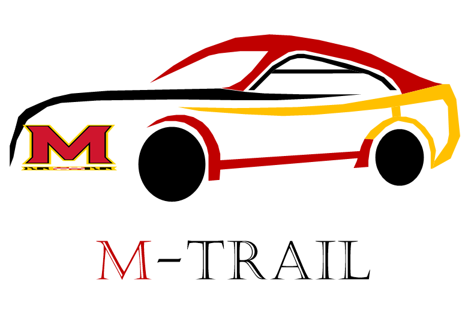
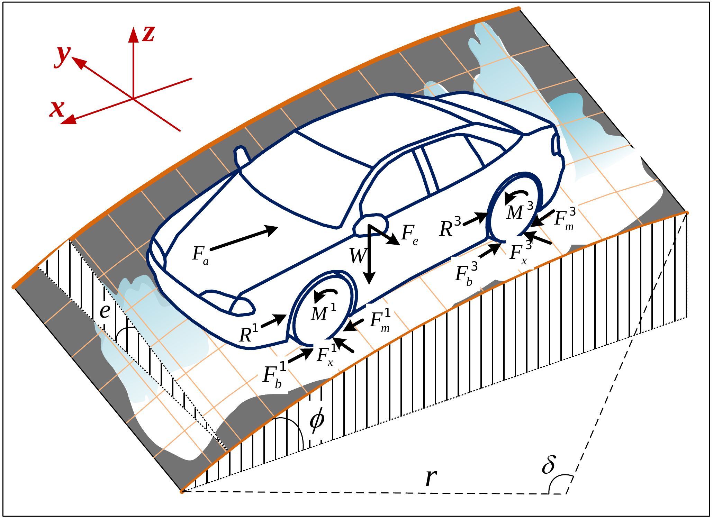
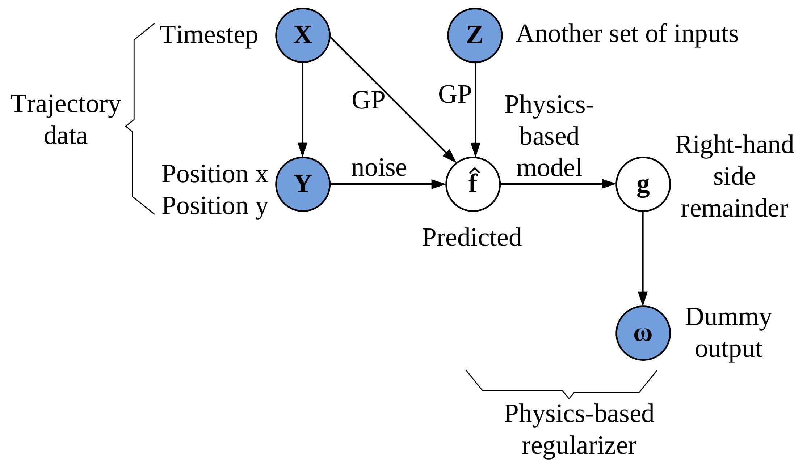
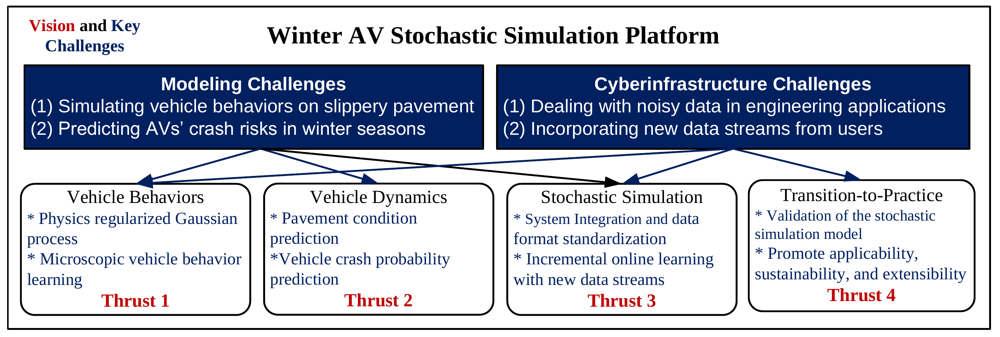
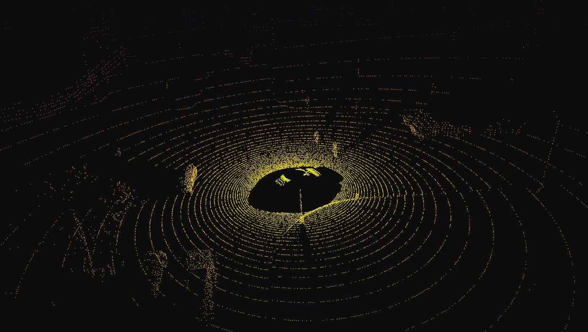
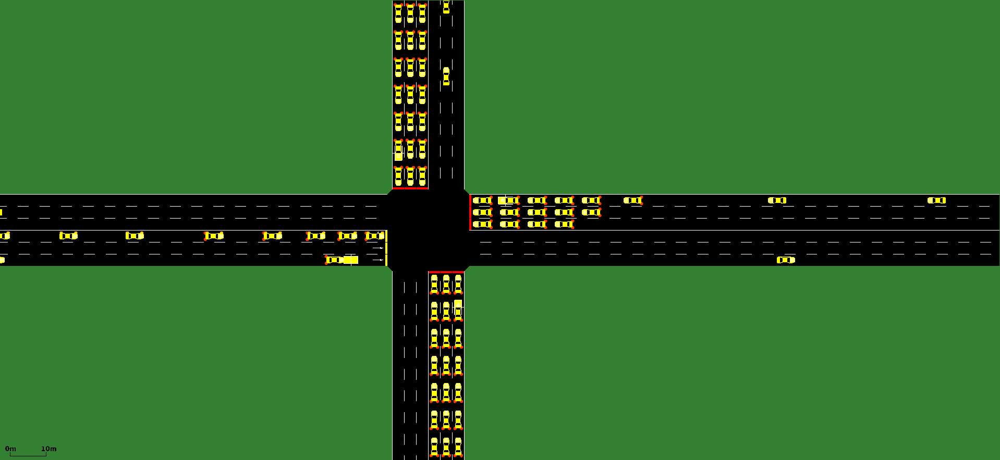
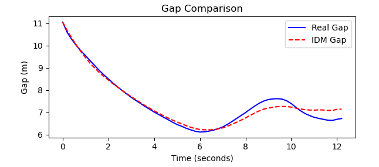

  

# Stochastic Simulation Platform for Assessing Safety Performance of Autonomous Vehicles in Winter Seasons
## Documentation

For detailed documentation, please visit: [NSF OAC Documentation](https://nsf-oac.readthedocs.io/en/latest/)

# Project Overview

This multidisciplinary research project aims to develop an advanced cyberinfrastructure toolkit that significantly improves algorithms in simulation and enhances fundamental knowledge in computing. The focus of the project is to create a stochastic simulation platform capable of thoroughly evaluating the capabilities of Autonomous Vehicles' (AVs) Automated Driving Systems (ADS), especially under adverse winter driving conditions.

The motivation behind this research is to build a reliable tool that can accurately model stochastic vehicle behaviors, study vehicle dynamics, and predict potential AV safety risks when faced with icy or snowy road conditions. This is crucial for ensuring the safety and reliability of AVs before widespread implementation.

## Key Objectives

- **Physics-Regularized Modeling**: Leverage the principles of physics through a Physics Regularized Gaussian Process (PRGP) model to enhance the machine learning process used for simulating vehicle interactions on icy/snowy roads.
  
- **Crash Risk Prediction**: Predict both multi-vehicle and single-vehicle crash probabilities in mixed traffic environments by integrating the traffic simulation model with a new vehicle dynamics model, accounting for the complexities of winter driving conditions.
  
- **Safety Assessment**: Conduct comprehensive safety assessments of AV performance on icy and snowy pavement by analyzing stochastic vehicle motions and the corresponding risk factors. 

  
  

- **Open-Source Platform Development**: Integrate the developed models into an open-source software package with extensive documentation and numerous application cases. The goal is to create a public, cloud-based platform that is easily accessible and capable of incorporating new data streams for continuous model improvement.

  

## Research Thrusts

To overcome the challenges associated with assessing AV safety in winter driving conditions, the project will focus on the following research thrusts:

- **Thrust 1: Stochastic Simulation with Vehicle Behavioral Modeling**  
  Using vehicle trajectories and pavement ice/snow patterns obtained from roadside videos as the training dataset, a novel microscopic model will be designed to simulate Human Vehicle (HV) behaviors on icy/snowy roads using the **Physics Regularized Gaussian Process (PRGP)** technique.

- **Thrust 2: AV Safety Assessment with Vehicle Dynamic Modeling**  
  By studying vehicle dynamic factors that affect AVs' safety performance on slippery roads, an efficient, reliable, and accurate model will be developed to predict the crash risks of AVs in a mixed HV-AV environment under adverse driving conditions.

- **Thrust 3: Platform Development with Incremental Online Learning**  
  The models and algorithms will be integrated into an open-source software package, with comprehensive documentation and numerous application cases. The expected deliverable is a public cloud-based service that is easy to access and capable of adopting new data streams from users for ongoing model improvement.

- **Thrust 4: Validation and Transition-to-Practice Plan**  
  Validation will first be conducted using field data collected in Utah. The transition-to-practice plan includes:  
  1. Connecting the platform to the existing federal cyberinfrastructure, CARMA, to ensure research sustainability.  
  2. Testing the simulation platform with the operating autonomous shuttles of the CARS Lab at Wayne State University.  
  3. Deploying this simulation platform to AV testbeds for broader application.

## Broader Impacts

The expected outcomes of this project include a public cloud-based simulation platform that not only facilitates the assessment of AV safety in winter conditions but also serves as a valuable resource for the broader AV research community. By validating the models with real-world data and integrating them with existing automated driving systems, this project aims to ensure the practical applicability and sustainability of the developed toolkit.

Additionally, this research has the potential to impact other scientific and engineering fields, such as physics-supported artificial intelligence, smart and autonomous systems, and any research domain that relies on simulated data for critical evaluations.

## CARLA Simulator

[CARLA](http://carla.org/) is an open-source simulator for autonomous driving research. It provides a highly flexible platform where you can test and validate autonomous vehicle (AV) models in realistic urban environments. CARLA supports the development, training, and validation of autonomous driving systems, with a variety of features including:

  

- **Highly Realistic 3D Environment**: CARLA provides a high-fidelity simulation environment with a variety of urban and rural settings, complete with buildings, vehicles, pedestrians, and weather conditions.
- **Flexible API**: The CARLA Python API allows for easy integration with different autonomous driving stacks, enabling control of vehicles, sensors, and the environment programmatically.
- **Open Source and Extensible**: CARLA is open-source and highly extensible, allowing researchers to modify and add new features according to their needs.

### Key Features

  
  

- **Multiple Sensors**: CARLA supports a wide range of sensors, including cameras, LiDARs, radars, and GNSS, which can be used to gather data or for real-time vehicle control.
- **Dynamic Weather**: The simulator allows for dynamic changes in weather and lighting, which is crucial for testing AV systems under different conditions.
- **Scenario Runner**: CARLA includes a Scenario Runner module to create complex driving scenarios for testing AVs, including multi-agent interactions and challenging driving conditions.

### Getting Started

To get started with CARLA, you can visit the [official documentation](https://carla.readthedocs.io/)&[NSF_OAC project documentation](https://nsf-oac.readthedocs.io/en/latest/) and follow the installation instructions. 

## SUMO (Simulation of Urban MObility)

[SUMO (Simulation of Urban MObility)](https://www.eclipse.org/sumo/) is an open-source, highly portable, microscopic, and continuous traffic simulation package designed to handle large road networks. SUMO allows researchers and developers to simulate how traffic evolves on real-world and fictional road networks, supporting a wide range of applications in traffic engineering, urban planning, and autonomous driving.

  

- **Microscopic Traffic Simulation**: SUMO simulates individual vehicle behavior, including lane changing, traffic light handling, and other complex interactions, allowing for detailed studies of traffic dynamics.
- **Multi-Modal Traffic Support**: In addition to vehicles, SUMO can simulate pedestrians, bicycles, and public transportation, providing a comprehensive view of urban mobility.
- **Open Source and Extensible**: SUMO is open-source and supports custom models and extensions, making it a versatile tool for traffic simulation research.

### Key Features

  
  

- **Flexible Network Import**: SUMO can import road networks from various sources, including OpenStreetMap (OSM), and allows users to define custom road networks using XML-based configuration files.
- **Traffic Demand Modeling**: SUMO provides tools for generating and simulating traffic demand, including vehicle routes, traffic lights, and other network elements.
- **Multi-Vehicle Integration**: SUMO can be used in conjunction with other simulators like CARLA for co-simulation, enabling comprehensive studies of autonomous vehicles in realistic traffic scenarios.

### Getting Started

To get started with SUMO, you can visit the [official documentation](https://sumo.dlr.de/docs/)&[NSF_OAC project documentation](https://nsf-oac.readthedocs.io/en/latest/) and follow the installation instructions. The SUMO community also provides a variety of tutorials and examples to help you learn how to use the simulator effectively.

## CARLA SUMO Co-Simulation

CARLA and SUMO can be integrated to create a comprehensive simulation environment that combines detailed vehicle dynamics with large-scale traffic management. This setup allows researchers to test autonomous vehicles in realistic traffic scenarios where CARLA handles vehicle behavior and sensor data, while SUMO manages overall traffic flow.

  

### Key Benefits

- **Realistic Traffic Scenarios**: CARLA provides high-fidelity vehicle simulation, while SUMO efficiently simulates large-scale traffic, enabling realistic urban driving environments.
- **Traffic and Signal Integration**: Synchronize traffic lights and signals between SUMO and CARLA to test vehicle interactions with traffic control systems.
- **Scenario-Based Testing**: Create and simulate complex traffic scenarios, such as dense urban traffic, to evaluate autonomous driving algorithms.

### Getting Started

For setup and configuration, refer to the [CARLA-SUMO co-simulation guide](https://carla-simulator.readthedocs.io/en/latest/adv_sumo/)&[NSF_OAC project documentation](https://nsf-oac.readthedocs.io/en/latest/).

## Resources
- [NSF_OAC project documentation](https://nsf-oac.readthedocs.io/en/latest/)
- [CARLA-SUMO Co-Simulation Documentation](https://carla-simulator.readthedocs.io/en/latest/adv_sumo/)
- [CARLA GitHub Repository](https://github.com/carla-simulator/carla)
- [CARLA Documentation](https://carla.readthedocs.io/)
- [CARLA Discord Community](https://discord.gg/carla-simulator)
- [SUMO GitHub Repository](https://github.com/eclipse/sumo)
- [SUMO Documentation](https://sumo.dlr.de/docs/)
- [SUMO User Community](https://sumo.dlr.de/wiki/Main_Page)

## Co-simulation Demo

This CARLA-SUMO co-simulation is designed to run in CARLA's Town04 environment, leveraging SUMO as the backbone for managing traffic flow. The simulation uniquely incorporates dynamic changes in weather conditions and road friction, reflecting real-world driving scenarios that autonomous vehicles may encounter.

  

### Dynamic Environmental Factors

- **Weather Variability**: The simulation dynamically adjusts weather conditions, including rain, fog, and varying levels of sunlight, to test the robustness of autonomous vehicle systems under different environmental challenges.
- **Friction Variation**: Road friction is dynamically altered during the simulation to simulate conditions such as icy or wet roads, which can significantly impact vehicle control and safety.

## Car-following Simulation Using Real-world Data
The [snowy vehicle trajectory dataset](https://github.com/M-trail/NSF_OAC/blob/main/Data/Snowy_I-695_Sample01.csv), [comprehensive guidelines for calibrating car-following model](https://github.com/M-trail/NSF_OAC/blob/main/Data/Guidelines%20for%20Calibrating%20Car-Following%20Models.pdf) and the [sample code](https://github.com/M-trail/NSF_OAC/blob/main/Data/Sample.ipynb) are provided to users.
### Snowy Vehicle Trajectory Data
Real-world snowy dataset was collected by the team at the I-695 highway segment in Baltimore, Maryland, United States on 01/15/2024 using a drone. A total of 50 minutes of video footage was captured in 4K resolution at 30 frames per second and subsequently processed into vehicle trajectory data. 

  

### Car-following Model Calibration

The Intelligent Driver Model (IDM) is a widely used car-following model in traffic flow theory. The IDM can be expressed mathematically as:

  

In this model, the free acceleration term, $$a\left[1 - \left(\frac{v_{n}}{v_{0}}\right)^{\delta}\right]$$, governs the vehicle’s acceleration. Here, $$a$$ represents the maximum possible acceleration, and $$v_{0}$$ denotes the desired speed of the vehicle. When the road ahead is clear, a stationary vehicle accelerates at the rate of $$a$$, with this rate gradually decreasing as the vehicle’s speed increases. The reduction in acceleration is controlled by the exponent $$\delta$$, ensuring that the vehicle does not exceed its desired speed. Following the IDM author's recommendation, $$\delta$$ is typically set to 4.

Calibration of a car-following model like the IDM involves selecting an appropriate optimization algorithm, a goodness-of-fit (GoF) function, and a measure of performance (MoP). One of the most effective algorithms for calibrating such models is the Genetic Algorithm (GA). This heuristic, nonlinear optimization technique, inspired by the principles of natural selection, has proven to be both robust and efficient for calibrating a wide range of car-following models.

The combination of MoP and GoF plays a crucial role in the success of the calibration process. In this example, we utilize the Root Mean Square Error (RMSE) of spacing as the performance metric, which can be computed as follows:

  

To ensure that the calibrated IDM parameters remain within realistic and practical bounds, the following constraints are applied:

- The time gap $$T$$ is restricted to the range of $$[0.1, 3]$$ seconds.
- The minimum spacing $$s_0$$ is set between $$[1, 5]$$ meters.
- The maximum acceleration $$a$$ is limited to $$[0.1, 4]$$ m/s², which corresponds to an acceleration rate allowing a vehicle to reach 100 km/h in approximately 6 seconds.
- The comfortable deceleration is capped at $$[0.1, 9]$$ m/s².
- The upper bound for the desired velocity $$v_0$$ is set at 33.6 m/s (120 km/h).

It is essential to note that the lower limit for $$v_0$$ should exceed the highest observed velocity in the dataset. This detail is often overlooked in other studies but is crucial, as exceeding $$v_0$$ in real-world conditions can lead to an exaggerated deceleration due to the power term $$(\frac{v_{n}}{v_{0}})^4$$. This factor underlines that $$v_0$$ in the IDM is primarily intended to model acceleration, not deceleration scenarios.

In this example, the GA calibration parameters are set as follows:

- The algorithm runs for a maximum of $$200$$ generations, with each generation comprising a population of $$100$$ individuals.
- The mutation rate is set at $$0.05$$.
- To balance computational intensity with model accuracy, a sampling rate of $$0.2$$ seconds is employed, which has been deemed sufficient for calibrating the car-following model.
The calibration result is shown as follow:

  

## News 
[2024/08/01] Version 1.0 released

## Contact
For more information or to get involved, please contact:

**Principal Investigator:**
Dr. Xianfeng Terry Yang
- A. James Clark School of Engineering, Civil and Environmental Engineering
- 3244 Jeong H. Kim Engineering Building
- Tel: 301-405-2881
- Email: xtyang@umd.edu

**Ph.D. Student:**
Dianwei Chen
- A. James Clark School of Engineering, Civil and Environmental Engineering
- 3107 Jeong H. Kim Engineering Building
- Tel: 301-405-7768
- Email: dwchen98@umd.edu

## Instructions for Building Customized Simulation
- Download the Calibrated Co-Simulation
- Submit Your Request [Here](https://docs.google.com/forms/d/e/1FAIpQLScdl_o81CnDwrLWl0toRjGA4rjD7miFQwG6giEKb38vaFUNdQ/viewform?usp=sf_link)

---
© 2024 Autonomous Vehicle Safety Performance Simulation Project
